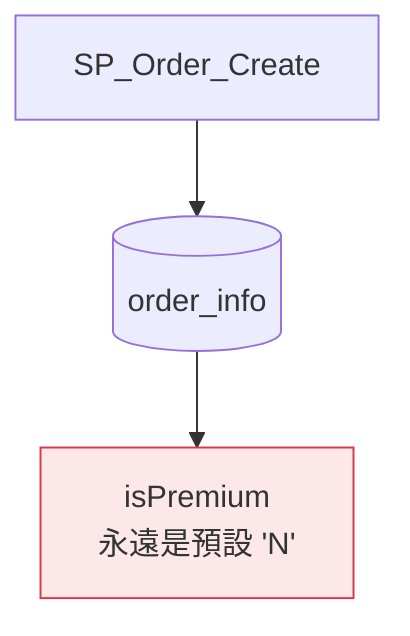
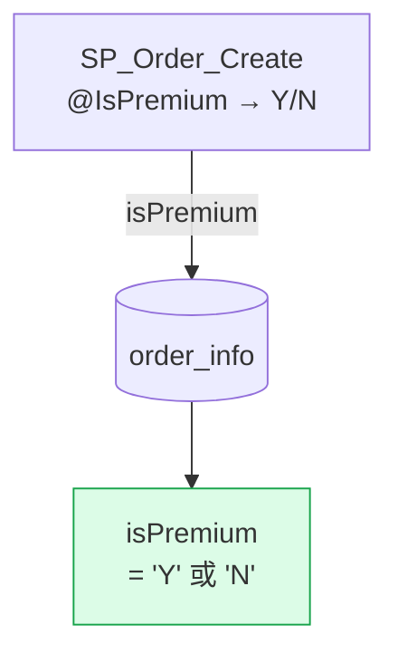

# openspec-design-html

Standalone skill that reads an existing OpenSpec change's artifacts and produces
`design.html` — an interactive Mermaid diagram page for reviewers.

Run this any time after artifacts exist: after `openspec-propose`, after editing `design.md`,
or to regenerate the HTML with updated content.

---

## Steps

### 1. Identify the change

Run:
```
openspec list --json
```

- **User named a change** → validate it exists, use it directly.
- **Only one active change** → use it without asking.
- **Multiple active changes** → use AskUserQuestion (single-select) to let the user pick.

### 2. Verify design.md exists

Check that `openspec/changes/<name>/design.md` exists.
If it does not, stop and tell the user: "design.md not found — run `/openspec-propose` first."

### 3. Read all artifacts

This skill starts with an empty context — read everything needed:

- `openspec/changes/<name>/design.md` — required. Primary source for diagrams and decisions.
- `openspec/changes/<name>/proposal.md` — "What Changes" names exact entry points to diagram. Read if it exists.
- `openspec/changes/<name>/specs/**/spec.md` — WHEN/THEN scenarios that can become flowchart nodes. Read each if they exist.
- `openspec/changes/<name>/tasks.md` — read for scope context only (e.g. number of touch points, implementation layers). Do NOT render tasks or checkboxes in the HTML.

### 4. Read the page shell

Read `.claude/skills/openspec-design-html/assets/page-shell.html` for CSS and component patterns.
Copy it as a starting point. Do not regenerate the CSS from scratch.

### 5. Generate design.html

Write to `openspec/changes/<name>/design.html`.

Follow all guidance below (Section Selection, Mermaid Rules, Before vs After, etc.).

### 6. Report

Tell the user:
- "design.html written to `openspec/changes/<name>/design.html` — open in browser to review."

---

## Section Selection Guide

Every design.html MUST include:

| Section | Always? | Source in design.md |
|---------|---------|---------------------|
| Header + chips | Yes | Change name + proposal "What Changes" |
| Scope (Goals / Non-Goals) | Yes | "Goals / Non-Goals" section |
| Before vs After | Yes | "Context" + "Decisions" → derive the delta |
| Decisions + Risks | Yes | "Decisions" + "Risks / Trade-offs" |

Add these when the content signals them:

| Signal in design.md | Add this section |
|--------------------|-----------------|
| Background logic exists that is **unchanged but required for understanding** | Background logic diagram (⑦) |
| Multiple "入口 / entry points / paths" listed | Detail cards grid (one card per entry point, see ③+) |
| Variable → field mappings listed | Mapping table + grouped flowchart side by side (⑤+) |
| "state / status / 狀態 changes" mentioned | State diagram |
| "class / service / component changes" | Class diagram |
| "API call / request / response sequence" | Sequence diagram |
| "data model / schema / table" changes | ER diagram |
| Hierarchical categories or config trees | Tree view |

### ⑦ Background Logic Diagram

When the design.md "Context" section describes a shared algorithm or logic that exists today,
is NOT being changed, but is essential for understanding WHY the change matters — add this
section immediately after the Scope section, before Before vs After.

Label it clearly: `"XXX（各入口共用，本次不修改）"` so the reviewer understands it's read-only context.

### ③+ Detail Cards with Snippets

When detail cards list multiple entry points, each card SHOULD include:

1. **Entry name** (monospace) + **layer · operation** (subdued text)
2. **Before badge** (red) — what was missing
3. **After badge** (green) — what was added
4. **Source variable** — the existing variable that carries the derived value (as `<code>`)
5. **Code snippet** — the actual expression or pattern to use (in a `.snippet` div)
6. **Implementation note** — a one-liner hint or warning specific to this entry point:
   - ℹ for easy/already-done items
   - ⚡ for especially easy wins
   - ⚠ badge (`.badge.b-yellow`) for risks

### ⑤+ Grouped Derivation Diagram

When showing a mapping from multiple source variables → one target field, group the sources
by architectural layer using Mermaid subgraphs:

```
subgraph SQL["SQL SP 入口"]
    V1["@IsPremium (BIT)"]
end
subgraph CS["C# 服務"]
    V2["@isPremium param"]
end
V1 -- "=1→'Y'  =0→'N'" --> F[("order_info\n.targetField")]
```

Always put the group label in the `subgraph id["Label"]` format (quoted).
Keep subgroup size small (2–4 nodes) — one subgraph per architectural layer.

---

## Mermaid Diagram Rules

**Labels with Chinese or special characters → always use double quotes:**
```
A["中文標籤"] --> B["Another node"]
```

**Line breaks in labels → use `<br/>`, not `\n`:**
```
A["Line one<br/>Line two"]
```

**Arrow labels with spaces → use double quotes:**
```
A -- "label with spaces" --> B
```

**Subgraph labels → always quote:**
```
subgraph SG1["Group Name"]
```

**Keep node labels short** (under ~30 chars).

**Style only key nodes** — Red for "broken/missing", green for "fixed/added":
```
style NodeX fill:#fce8e8,stroke:#dc3545,color:#7f1d1d
style NodeY fill:#dcfce7,stroke:#16a34a,color:#14532d
```

---

## Before vs After Construction

**Before diagram** — current state, problem node in red:


**After diagram** — fixed state, improvement in green:


If Before and After have the same shape but different edge labels or node colors,
that visual similarity is intentional — it makes the delta obvious by subtraction.

---

## Choosing the Right Diagram Type

| Design content | Best Mermaid type |
|---------------|-------------------|
| Data flows, code paths, "who calls what" | `flowchart TD` or `flowchart LR` |
| Status field transitions | `stateDiagram-v2` |
| Service or class structure changes | `classDiagram` |
| Table schema / foreign key relationships | `erDiagram` |
| API request/response between services | `sequenceDiagram` |
| Config categories or hierarchical options | `block-beta` or `graph` |

When in doubt, `flowchart LR` is the safest default.

---

## Header Chips

Pick 3–5 from:
- Number of affected files/SPs/services
- Layer breakdown (e.g. `SQL SP × 3`, `C# × 2`)
- Scope constraints from Non-Goals
- Breaking change warning if applicable

## Field Schema Note

If the change targets a specific DB column and its type/default is known, surface it on the page
(chip, scope card, or near the derivation table). Only include if confident — don't guess.
Example: `VARCHAR(10) DEFAULT 'N'`.

---

## Quality Check Before Saving

1. **Mermaid syntax** — all special-char labels use double quotes? No raw `\n` in labels?
2. **Grid balance** — each `.grid-2` has exactly two children? Each `.cmp-grid` exactly two panels?
3. **Before/After contrast** — Before has red problem node? After has green fix?
4. **No empty sections** — every `<section>` tag has visible content.
5. **CSS not regenerated** — the `<style>` block comes from `page-shell.html`, not rewritten.
