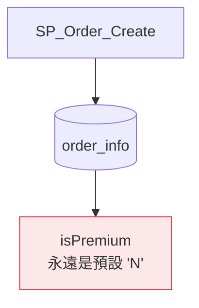
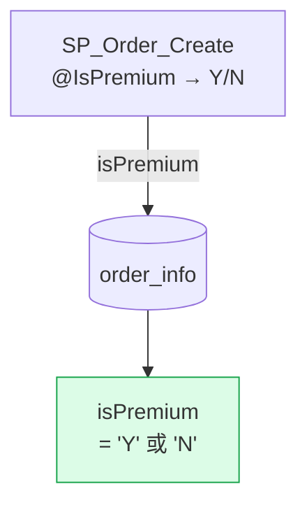

# openspec-propose-design-mermaid-html

An extension of `openspec-propose` that appends one step: after `design.md` is generated,
produce a `design.html` next to it. The HTML uses Mermaid diagrams so a reviewer can scan
the full design in seconds — states, flows, before/after — instead of parsing paragraphs.

---

## Steps 1–5: Follow openspec-propose exactly

Do everything the standard `openspec-propose` skill does:

1. If no clear input, ask what the user wants to build via AskUserQuestion.
2. `openspec new change "<name>"`
3. `openspec status --change "<name>" --json` to get artifact build order.
4. Create each artifact in dependency order until all `applyRequires` are satisfied.
5. `openspec status --change "<name>"` to confirm completion.

After step 5 confirms all artifacts are done, proceed to step 6.

---

## Step 6: Generate design.html

### What to read

Read all available artifacts before generating — they are all complete at this point:

- `design.md` — required. Primary source for diagrams and decisions.
- `proposal.md` — "What Changes" names the exact entry points to diagram.
- `specs/**/spec.md` — WHEN/THEN scenarios that can become flowchart nodes.
- `tasks.md` — read for scope context only (e.g. number of touch points, implementation layers). Do NOT render tasks or checkboxes in the HTML — design.html is a read-only visual reference, not a task tracker.

### Where to write

`openspec/changes/<name>/design.html` — same directory as `design.md`.

### How to build the page

Read `assets/page-shell.html` (this skill's bundled file) for the CSS and component patterns.
Copy it as a starting point and fill in the content. Don't regenerate the CSS from scratch.

The shell has comment blocks showing all available section patterns (①–⑥).
Read the comments to understand what each pattern looks like before deciding which ones to use.

---

## Section Selection Guide

Every design.html MUST include:

| Section | Always? | Source in design.md |
|---------|---------|---------------------|
| Header + chips | Yes | Change name + proposal "What Changes" |
| Scope (Goals / Non-Goals) | Yes | "Goals / Non-Goals" section |
| Before vs After | Yes | "Context" + "Decisions" → derive the delta |
| Decisions + Risks | Yes | "Decisions" + "Risks / Trade-offs" |

Add these when the content signals them:

| Signal in design.md | Add this section |
|--------------------|-----------------|
| Background logic exists that is **unchanged but required for understanding** | Background logic diagram (⑦) |
| Multiple "入口 / entry points / paths" listed | Detail cards grid (one card per entry point, see ③+) |
| Variable → field mappings listed | Mapping table + grouped flowchart side by side (⑤+) |
| "state / status / 狀態 changes" mentioned | State diagram |
| "class / service / component changes" | Class diagram |
| "API call / request / response sequence" | Sequence diagram |
| "data model / schema / table" changes | ER diagram |
| Hierarchical categories or config trees | Tree view |

### ⑦ Background Logic Diagram

When the design.md "Context" section describes a shared algorithm or logic that exists today,
is NOT being changed, but is essential for understanding WHY the change matters — add this
section immediately after the Scope section, before Before vs After.

Label it clearly: `"XXX（各入口共用，本次不修改）"` so the reviewer understands it's read-only context.

Example: a "會員等級判斷邏輯" flowchart showing the `order_total >= 1000` branching.
This makes the Before/After diagrams much more legible because the reviewer already knows the algorithm.

### ③+ Detail Cards with Snippets

When detail cards list multiple entry points, each card SHOULD include:

1. **Entry name** (monospace) + **layer · operation** (subdued text)
2. **Before badge** (red) — what was missing
3. **After badge** (green) — what was added  
4. **Source variable** — the existing variable that carries the derived value (as `<code>`)
5. **Code snippet** — the actual SQL expression or C# pattern to use (in a `.snippet` div):
   ```
   CASE WHEN @Var='B'
    THEN 'Y' ELSE 'N' END
   ```
6. **Implementation note** — a one-liner hint or warning specific to this entry point:
   - ℹ for easy/already-done items (e.g., "已算好，直接引用")
   - ⚡ for especially easy wins (e.g., "參數已存在，只需補欄位宣告")
   - ⚠ badge (`.badge.b-yellow`) for risks that apply to this specific entry point

The code snippet + note are what separate a useful card from a generic one.
They answer "what exactly do I write here?" without opening the spec.

### ⑤+ Grouped Derivation Diagram

When showing a mapping from multiple source variables → one target field, group the sources
by architectural layer using Mermaid subgraphs. This prevents the diagram from looking like
a flat fan-in and makes the layer boundary visible:

```
subgraph SQL["SQL SP 入口"]
    V1["@IsPremium (BIT)"]
    V2["@MemberTier ('P'/'S')"]
end
subgraph CS["C# 服務"]
    V3["RIGHT(channel_type,1)"]
    V4["@isPremium param"]
end
V1 -- "=1→'Y'  =0→'N'" --> F[("order_info\n.targetField")]
```

Always put the group label in the `subgraph id["Label"]` format (quoted).
Keep subgroup size small (2–4 nodes) — one subgraph per architectural layer.

---

## Mermaid Diagram Rules

These rules prevent the most common rendering failures:

**Labels with Chinese or special characters → always use double quotes:**
```
A["中文標籤"] --> B["Another node"]
```

**Line breaks in labels → use `<br/>`, not `\n`:**
```
A["Line one<br/>Line two"]
```

**Arrow labels with spaces → use double quotes:**
```
A -- "label with spaces" --> B
```

**Subgraph labels → always quote:**
```
subgraph SG1["Group Name"]
```

**Keep node labels short** (under ~30 chars). Put detail in tooltips or nearby text, not labels.

**Style only key nodes** — don't over-style. Red for "broken/missing", green for "fixed/added":
```
style NodeX fill:#fce8e8,stroke:#dc3545,color:#7f1d1d
style NodeY fill:#dcfce7,stroke:#16a34a,color:#14532d
```

---

## Before vs After Construction

The Before/After pair is the most valuable part of the page. Here's how to construct it:

**Before diagram** — shows the current state: what was broken, missing, or absent.
Pick nodes from the "Context" section. Mark the problem node in red:


**After diagram** — same structure, but nodes reflect the fixed state.
Use the "Decisions" section to identify what was added/changed. Mark improvements in green:


If the "Before" and "After" have the same shape but different edge labels or node colors,
that visual similarity is intentional — it makes the delta obvious by subtraction.

---

## Choosing the Right Diagram Type

| Design content | Best Mermaid type | Why |
|---------------|-------------------|-----|
| Data flows, code paths, "who calls what" | `flowchart TD` or `flowchart LR` | Shows direction |
| Status field transitions (e.g., reg_type, status) | `stateDiagram-v2` | States are first-class |
| Service or class structure changes | `classDiagram` | Inheritance/composition visible |
| Table schema / foreign key relationships | `erDiagram` | Entities and cardinality |
| API request/response between services | `sequenceDiagram` | Temporal order |
| Config categories or hierarchical options | `block-beta` or `graph` | Nesting |

When in doubt, `flowchart LR` is the safest default — it works for almost anything and degrades gracefully.

---

## Header Chips

The `.chip` elements give a quick "at a glance" summary. Pick 3–5 from:
- Number of affected files/SPs/services (e.g., `5 個入口`)
- Layer breakdown (e.g., `SQL SP × 3`, `C# × 2`)
- Scope constraints from Non-Goals (e.g., `只補資料，不改邏輯`)
- Breaking change warning if applicable

## Field Schema Note

When the change targets a specific DB column and its type / default is known from the design
context, surface that info somewhere on the page. It doesn't need a fixed location — a chip
in the header, a note in the Scope card, or a small line near the derivation table all work.

The important thing is that the reviewer can see `TYPE DEFAULT 'value'` without opening the
schema. Only include this if you are confident — don't guess. Example:
`VARCHAR(10) DEFAULT 'N'` next to the column name.

---

## Quality Check Before Saving

Before writing the file, mentally verify:

1. **Mermaid syntax** — do all special-char labels use double quotes? No raw `\n` in labels?
2. **Grid balance** — does each `.grid-2` have exactly two children? Each `.cmp-grid` exactly two panels?
3. **Before/After contrast** — does the Before diagram have a red-styled problem node? Does After have a green-styled fix?
4. **No empty sections** — every `<section>` tag has visible content.
5. **CSS not regenerated** — the `<style>` block comes from `page-shell.html`, not rewritten.

---

## Output Summary

After generating the HTML, tell the user:
- "design.html written to `openspec/changes/<name>/design.html` — open in browser to review."
- Then continue with the remaining artifacts (specs, tasks) as normal.
