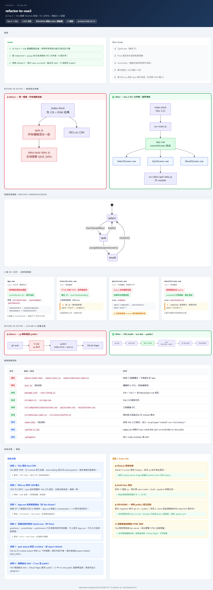

# openspec-custom-skills

基於 [OpenSpec](https://github.com/Fission-AI/OpenSpec/) 的個人擴充 skills，加了視覺化設計頁面與一鍵 archive 流程，並搭配繁體中文輸出的 config。

## 前置需求

本套件基於 [OpenSpec](https://github.com/Fission-AI/OpenSpec/)，使用前需先完成 OpenSpec 安裝與初始化。

**需求**：Node.js 20.19.0 以上

```bash
npm install -g @fission-ai/openspec@latest
```

進入你的專案目錄後初始化：

```bash
cd your-project
openspec init
```

選擇 **Claude Code** 後會在專案中建立 `.claude/skills/`（原生 skills）與 `openspec/` 目錄。  
建議：保留 skills 資料夾，移除 commands 資料夾（依個人使用場景決定）。  
兩種整合方式的差異說明：[Supported Tools](https://github.com/Fission-AI/OpenSpec/blob/main/docs/supported-tools.md)。

詳細說明請參考 [OpenSpec 文件](https://github.com/Fission-AI/OpenSpec/blob/main/docs/getting-started.md)。

**基本工作流程**

```
/openspec-propose ──► /openspec-apply-change ──► /openspec-archive-change
```

`openspec init` 後的目錄結構：

```
openspec/
├── specs/              # 系統當前行為的 source of truth
├── changes/            # 每個 change 一個資料夾
│   └── <change-name>/
│       ├── proposal.md   # why & what
│       ├── design.md     # how（技術方案）
│       ├── tasks.md      # 實作 checklist
│       └── specs/        # delta specs（此次異動）
└── config.yaml         # 專案設定（選填）
```

---

## 使用方式

把想要的 skill 複製到你的專案 `.claude/skills/` 目錄下即可。  
`openspec/config.yaml` 可複製到你的專案 `openspec/config.yaml` 覆蓋語言設定。

---

## Skills

### OpenSpec 原生（由 `openspec init` 產生）

| Skill | 說明 |
|-------|------|
| `openspec-propose` | 建立新 change，產生 proposal、design、specs、tasks |
| `openspec-apply-change` | 從現有 change 開始實作任務 |
| `openspec-archive-change` | 封存單一完成的 change |
| `openspec-explore` | 思考夥伴模式，適合 change 前後的探索與釐清 |

### 擴充 Skills

| Skill | 說明 |
|-------|------|
| `openspec-propose-design-mermaid-html` | `openspec-propose` 的擴充版，完成所有 artifacts 後額外產生互動式 `design.html` |
| `openspec-design-html` | 從現有 change 的 artifacts 單獨產生 `design.html`，不重跑 propose |
| `openspec-complete-archive-change` | 一鍵完成 tasks 打勾、specs 同步、archive，設計給已上 production 的場景 |

---

#### `openspec-propose-design-mermaid-html`

`openspec-propose` 的擴充版。執行完全相同的 proposal → design → specs → tasks 流程，**所有 artifacts 完成後**，再額外產生一份 `design.html`。

頁面 CSS 與元件範本由隨附的 `assets/page-shell.html` 提供，依 design.md 內容自動挑選適合的 section：

| 類型 | Section |
|------|---------|
| 必選 | Scope（Goals / Non-Goals）、Before vs After、Decisions + Risks |
| 按需 | Detail cards（多入口點 + 程式碼片段）、Mapping table + 衍生圖、Full diagram（class / ER / sequence / state）、Background logic |

讓 reviewer 掃一眼就能理解 change 的全貌，不需要逐段讀 Markdown。  
適合：有多個入口點、狀態轉換、資料流向需要視覺化的 change。

---

#### `openspec-design-html`

從現有 change 的 artifacts 產生 `design.html`，**不重跑 propose 流程**。

適合在以下情境單獨呼叫：

- 執行了 `openspec-propose` 但當時沒產 HTML
- 修改了 `design.md` 後想重新產出視覺頁
- 想在 propose 之外的時機更新設計頁

觸發語：`產 design.html`、`generate design html`、`visualize the change`、`幫我產設計頁`。



---

#### `openspec-complete-archive-change`

一鍵完成已部署 change 的收尾工作：把所有未打勾的 tasks 標為完成、把 delta specs 同步回主 specs、執行 archive。不會問確認——設計給「已上 production，補紙本」的場景。

觸發語：`驗證打勾`、`幫我打勾`、`archive 完成的 change`、`close out`、`finalize change`。

---

## Config（`openspec/config.yaml`）

- 預設以繁體中文（zh-TW）輸出所有文件與回覆
- 程式碼識別字、指令、API 名稱等保留英文原文
- 各 artifact（proposal、spec、tasks）有對應的品質規則：具體可驗證、不得弱化約束條件
